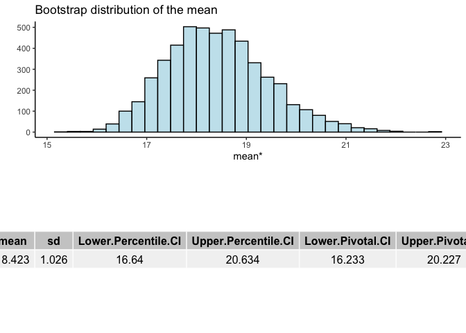
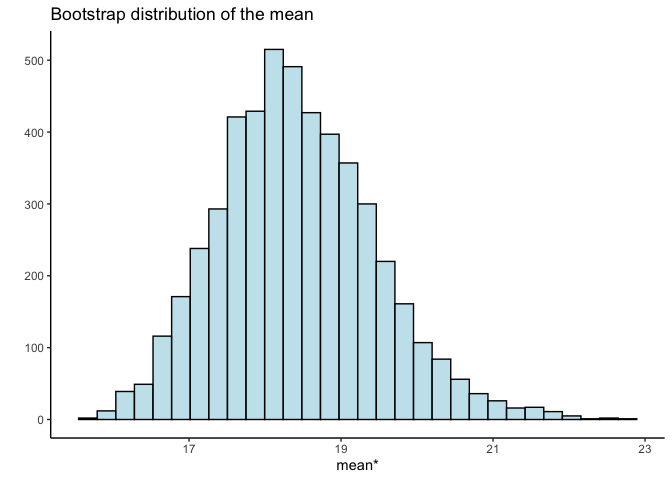

<!-- README.md is generated from README.Rmd. Please edit that file -->

# rbooty

<!-- badges: start -->
<!-- badges: end -->

rbooty provides comprehensive functions for bootstrapping.

## Installation

You can install the the development version from
[GitHub](https://github.com/) with:

``` r
# install.packages("devtools")
devtools::install_github("lana1218/rbooty")
```

``` r
library(rbooty)
```

## Summarizing the bootstrap distribution

- `bs_summarize()` allows you to output the summary statistics and
  resulting bootstrap distribution in one output, given a desired
  statistic (mean, median, quantile, sd, iqr)

``` r
library(rbooty)

bs_summarize(tips$TipPercent, stat = "mean")
```



## Other Use Cases

You can calculate the statistics for the bootstrap distribution
independently. bs_loc_stat can be used to bootstrap a location-based
statistic such as the mean, median, or any quantile. bs_scale_stat can
be used to to bootstrap a scale-based statistic such as the sd or iqr.

``` r
median_stat <- bs_loc_stat(tips$TipPercent, stat = "median")
str(median_stat)
#> List of 5
#>  $ mean         : num 17.1
#>  $ s_boot       : num 0.904
#>  $ percentile_ci: num [1:2] 16 19
#>  $ pivotal_ci   : num [1:2] 14.8 17.8
#>  $ boot_dist    : num [1:5000] 18.3 18.1 17.5 16.4 16.2 ...

sd_stat <- bs_scale_stat(tips$TipPercent, stat = "sd")
str(sd_stat)
#> List of 5
#>  $ mean         : num 5.51
#>  $ s_boot       : num 1.39
#>  $ percentile_ci: num [1:2] 2.85 8.06
#>  $ pivotal_ci   : num [1:2] 4.12 11.65
#>  $ boot_dist    : num [1:5000] 3.05 7.37 7.76 5.27 3.12 ...
```

You can also get a dataframe of the bootstrap distribution.

``` r
boot_dist <- bootstrap(tips$TipPercent, stat = "mean")

head(boot_dist)
#> [1] 18.10000 16.76667 18.08333 18.70333 17.47333 19.51667
```

You can use bs_plot to plot a bootstrap distribution.

``` r
bs_plot(boot_dist = boot_dist, stat = "mean")
#> `stat_bin()` using `bins = 30`. Pick better value with `binwidth`.
```


